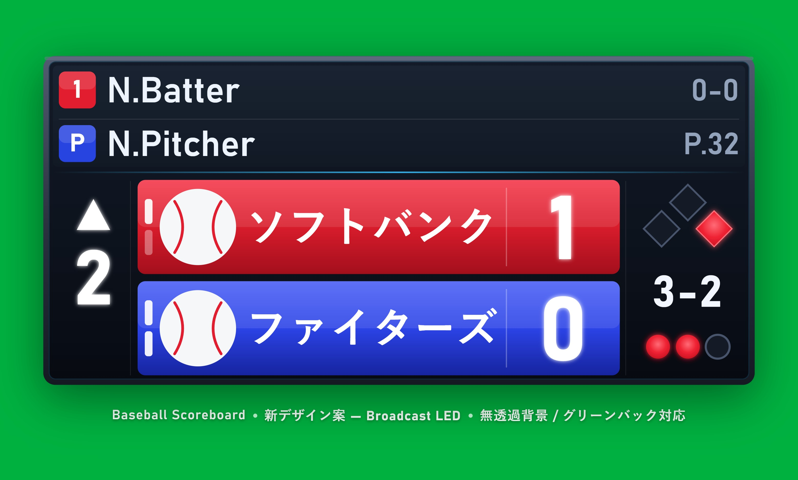

# Baseball Scoreboard Design Blueprint

このファイルは、野球スコアボードアプリの画面構成、スコアボードの見た目、メニューを整理する設計図です。
プロジェクト全体のルール（技術スタック・実装順・コーディング規約・未決事項）は `rules.md`、
実装したい構造は `operation.md` に置きます。

詳細ファイル:

- プロジェクト全体のルール（技術スタック・実装順・コーディング規約・未決事項）: `rules.md`
- 実装したい構造と操作ルール: `operation.md`
- データ構造の詳細: `data_model.md`
- ボタン一覧の詳細: `button_list.md`
- 起動、終了、基本的な使い方の説明: リポジトリ直下の `README.md`

## 1. Project Summary

ローカルPCで起動し、ブラウザからアクセスできる野球用スコアボードを作る。
同一ネットワーク上の別端末からもアクセスできる前提とし、PC側のポート開放やネットワーク設定はこのアプリでは扱わない。

Codex GUI上でのやり取りや画面文言は日本語にする。
ただし、フォルダ名とファイル名は英語アルファベットで統一する。

主な利用シーンは、配信画面にスコアボードを重ねること、別画面からスコアを操作すること、チーム情報や選手名を保存して再利用すること。

対応環境の前提:

- アプリを起動するコンピューターは、将来的にWindowsとLinuxの両対応を前提とする。
- ブラウザからアクセスする端末は、Windows、Linux、macOS、スマホを対象にする。
- 起動したコンピューター自身では、`http://localhost:52582` でアクセスできることを基本とする。
- 同一ネットワーク上の別端末からは、起動したコンピューターのIPアドレスとポート番号でアクセスする。

ポート番号の方針:

- デフォルトのポート番号は `52582` とする。
- 追加で別のポート番号が必要な場合は、`52583`, `52584` のように続きの番号を使う。
- PC側のポート開放やファイアウォール設定は、このアプリでは自動変更しない。

## 2. Page Structure

### 2.1 Home Page

トップページ。

配置するボタン:

- スコアボードを見る
- スコアボードを動かす

共通ナビゲーションは上部ボタンを並べず、左側のサイドメニューに `HOME`、`見る`、`動かす`、`設定` を格納する。

想定URL:

- `/`

### 2.2 Viewer Page

稼働中のスコアボードをすべて並べて表示するページ。
配信ソフトのブラウザソースで使うことを想定する。

主な機能:

- 稼働中スコアボードの一覧表示
- 各スコアボードの表示位置変更
- 各スコアボードの拡大、縮小
- 最後に調整したスコアボードを、重なったとき最前面に表示
- 端末ごとのスコアボードサイズ変更
- 背景色の変更
- 表示設定の保存
- 操作画面からの変更をリアルタイム反映
- 共通ナビゲーションは左側のサイドメニューから開く

サイズ方針:

- デフォルトでスコアボードの横幅、高さ、比率を設定し、以降のサイズは表示中の端末ごとに固定値として扱う。
- 複数端末で表示する場合、スコアボード表示ページのプロパティから端末ごとにサイズを編集できる。
- 端末ごとのサイズ変更や表示位置は、他の端末には影響させない。
- スコアボードの中央部分をドラッグすると表示位置を変更できる。
- スコアボードの端または角をドラッグすると、OSのウィンドウサイズ変更のように拡大率を変更できる。
- サイズ調整用のスライダーは置かず、スライダーは拡大率に統一する。
- 拡大率とサイズは数値入力でも変更でき、ドラッグ操作や端リサイズで値が変わった場合は入力欄にも反映する。
- Viewer Pageで位置、拡大率、サイズを最後に調整したスコアボードが、重なったとき一番前に出る。
- スコアボードの表示位置は、ボードの右下を基準点として保存する。攻守交代の中間表示・試合終了時に対戦選手表示欄が折りたたまれてボード高さが縮んでも、右下の位置は動かず、上端側だけが伸縮して見える（詳細は3.4）。
- 端末ごとの表示プロパティはブラウザ内に保存する。
- ブラウザ側で表示プロパティを入出力できるようにする。
- 配信画面用に操作UIを完全に非表示にする専用モードは将来追加できる設計にするが、優先度は最下位とする。

想定URL:

- `/viewer`

保存対象（すべて各ブラウザ内に保存）:

- viewer background color
- per-board viewer scale
- per-device board size derived from scale
- scoreboard positions
- scoreboard display order based on last viewer adjustment
- viewer property export data

### 2.3 Control List Page

「スコアボードを動かす」ページ。
稼働中のスコアボードを一覧表示し、選択してスコア入力画面に入る。
この一覧ではスコアボードの視覚プレビューは表示しない。
代わりに、現在の対戦スコアを `Team A 1-0 Team B 1回裏` のようなテキストで表示する。

主な機能:

- 稼働中スコアボードの一覧表示
- 現在の対戦スコアのテキスト表示
- 新規スコアボード作成
- スコアボード選択
- スコアボード名変更
- 不要なスコアボード削除

削除時の扱い:

- そのスコアボードの試合状態、選手名、操作履歴は削除する。
- チームプリセット、共通設定、表示設定は削除しない。
- 手動でスコアボードを削除する場合は、必ず確認を取る。
- 24時間アクセスなしの自動削除では、確認を取らずに削除する。

想定URL:

- `/control`

### 2.4 Score Input Page

個別スコアボードの操作画面。

主な機能:

- ボール、ストライク、アウト、得点、ランナー、イニングの操作
- 一塁、二塁、三塁のランナーON/OFF
- 先攻、後攻それぞれの得点 +1 / -1
- 打席結果の入力
- ABS回数の操作
- 戻る、進む
- 編集メニューの表示
- 選手名メニューの表示
- 操作結果を閲覧画面へリアルタイム反映
- スマホではスコアボードの横幅と操作ボタンの並びを画面幅に合わせて縮小し、横スクロールを避ける。ページ全体のピンチアウトによる拡大は妨げない。
- スマホでは、スコア入力中にスコアボードを画面上部へ常時表示する。スコアボードは通常のレイアウト領域を確保したまま固定表示し、初期表示時の操作ボタン類がスコアボードに重ならないようにする。
- 操作ボタンは種類ごとに色を使い分ける。ボールと四球は緑、ストライクとファウルは黄、ヒットは青を基本にする。
- 「試合終了」ボタンを置き、確認ダイアログでその時点のスコアから自動判定した勝敗をプレビュー表示した上で試合終了状態を確定する。演出の詳細は3.4を参照。

想定URL:

- `/control/:boardId`

### 2.5 Settings Page

アプリ全体の設定画面。
React版では、全体設定とチームプリセット編集を同じ `/settings` 画面に置く。
プリセット編集はカード形式で表示し、各カードの入力内容は保存ボタンを押すまで保持する。

主な機能:

- チームプリセットの作成、編集、削除
- チームプリセット並べ替え画面への移動
- チームプリセットのドラッグ並べ替え
- プリセット名の編集
- チーム名、チームロゴ、略称、チームカラー、文字色の保存
- スコアボード/プリセットで使われていないロゴの削除
- 汎用設定の追加
- アクセスがない場合の自動削除設定
- 一時演出の表示秒数設定
- プリセット並べ替えは、現代のスマホのリスト並べ替えに近い、仕切りなしの横三本線アイコンをドラッグして滑らかに順番を変えるUIにする。
- プリセット並べ替えでは、カーソル/指の位置に基づいて移動先を判定し、周囲のカードがアニメーションしながら退くようにする。

想定URL:

- `/settings`
- `/settings/presets/reorder`

## 3. Scoreboard Visual Design

レイアウトの参考画像は `design_plan.jpg`。
採用するビジュアルデザインは `design_claude_fable.jpg`（詳細は 3.2）。
`design_plan.jpg` は配置の指針として使い、細かなズレは再現せず、実装時はバランスを整えて配置する。

### 3.1 基本レイアウト

基本レイアウト:

- 全体は黒基調（紺〜黒のグラデーション）の横長スコアボード。背景は無透過。
- 左側にイニング表示
- 中央にチーム情報と得点
- 右側にランナー、カウント、アウト数
- 上側に対戦選手表示オプション
- 文字の書体・サイズの詳細は 3.3 のタイポグラフィに従う。
- 打順番号と `P` の背景四角は、文字が視認しやすい大きさにする。
- バッター行とピッチャー行の間には、通常文字色と同じ白の仕切り線を左から右まで一直線に入れる。
- 対戦選手表示欄とスコアボード本体の間の仕切り線（アクセントライン）は、ピッチャー行からの間隔が、バッター行とピッチャー行の間の仕切り線とバッター行との間隔と同じになるよう配置する。この仕切り線は、対戦選手表示欄が縮小・非表示のときはアニメーションなしで非表示にする（18.5参照）。
- イニング表記、チーム名、得点、ランナー表記、カウント、アウト数は、上部の選手表記より大きく表示する。

表示要素:

- イニング数
- 表、裏の表示
- 先攻チームロゴ
- 先攻チーム略称
- 先攻チーム略称の拡大率
- 先攻チーム略称の中央揃え設定
- 先攻得点
- 後攻チームロゴ
- 後攻チーム略称
- 後攻チーム略称の拡大率
- 後攻チーム略称の中央揃え設定
- 後攻得点
- ランナー表示
- ボール、ストライク
- アウト数
- ABSチャレンジ残数
- バッター名
- ピッチャー名
- バッター成績
- ピッチャー球数
- 一時演出表示
- 攻守交代の中間表示（"Mid 1st"/"End 2nd"など）
- 試合終了表示（"Final"）

一時演出:

- ホームラン時: `HOME RUN`
- 空振り三振時: `K`
- 見逃し三振時: 逆向きの `K`
- ホームランなど通常の一時演出の表示秒数は、スコアボードごとではなく全体の設定で変更する。
- 三振演出は3秒固定で表示し、ランナー・カウント・アウト表記の列だけに限定した領域いっぱいの大きさで`K`を表示する。ホームラン演出は`HOME RUN`をスコアボード横幅の9割程度の大きさで表示する。

得点はスコアボード内で最も大きく表示する。
チームカラー上の文字色はチームごとに設定可能とし、初期値は白にする。

### 3.2 採用デザイン: Broadcast LED スタイル

参考画像: `design_claude_fable.jpg`

方針:

- 従来の基本CSS版は、平坦な塗りと標準的な枠線で情報は読めるが、放送映像に重ねると素朴で古い印象になっていた。
- 新デザインは、テレビ中継のスコアバグに近い「Broadcast LED」スタイルにする。
- 配置は `design_plan.jpg` を維持したまま、質感と視認性を引き上げる。
- 画像はグリーンバック上に配置し、無透過背景でクロマキー運用に耐えることを示している。

ビジュアルの要点:

- 本体は角丸のダークパネルに、金属質のベゼル（外枠）と柔らかいドロップシャドウを重ねて奥行きを出す。
- 背景は暗い紺〜黒の縦グラデーションで、無透過のまま。グリーンバックに重ねてクロマキー抜きできる前提を崩さない。
- スコアボード全体は横長にしつつ、チーム枠は略称拡大率100%・略称圧縮100%のときに全角4文字程度が収まる幅へ縮小する。
- チームカラーの帯は上→下の縦グラデーションと上部のハイライトで、平坦ではなく立体的なバー表現にする。
- チームカラーの帯（チーム枠）は、2桁得点まで余裕を持って収まる大きさを確保する。
- チームロゴはチーム帯の高さの8割程度まで大きく表示する。
- チームロゴは透過画像（透過PNGなど。JPEGは透過を保持できない）をそのまま描画し、丸い仕切り線・円形の枠・背景の円は付けない。透過部分からチームカラーがそのまま見えることで、ロゴがきれいに表示されるようにする。モックアップ内の野球ボールはプレースホルダーである。
- チーム略称は拡大率を上げてもチーム枠の上下中央に置く。最大拡大率は180%とし、最大時はチーム枠の高さの8割程度まで大きく表示する。縦位置は文字の外接箱ではなく、英字のC右側に見える空欄など、実画面上の上下の空きが視覚的に均等に見える位置を基準にする。
- チーム略称には横幅だけを変える略称圧縮を設定できる。30%から120%までとし、50%なら縦のフォントサイズはそのまま、横幅だけ半分にする。
- チーム略称には、ロゴの仕切りから得点の仕切りまでの略称枠内で左右中央に配置する「略称中央揃え」を設定できる。OFFの場合は従来どおりロゴ側から左揃えで表示する。
- チーム略称がチーム枠からはみ出す場合は、はみ出した部分だけを表示しない。上チームと下チームの枠は個別にクリップし、片方のチーム略称がもう片方のチーム枠内に表示されないようにする。
- 得点は最大サイズの白文字にし、淡いグローを添えて最も目立たせる。
- 得点の数字は、チーム帯の右端いっぱいに確保した固定幅の得点スロットの中で左右中央揃えにする。これにより、2桁得点（例: 20点）でも桁が重ならず、チーム帯の大きさも変わらない。
- 得点スロットの左端には薄い仕切り線を入れ、得点部分とチーム略称の領域を分ける。チーム略称が長い場合は、略称拡大率、略称圧縮、略称中央揃えを手動で調整して表示を整える。
- イニングの数字はイニング枠の上下中央に置く。表の上向き三角は数字の上、裏の下向き三角は数字の下に置く。
- 上部の打者・投手行の間には、参考画像どおり左右いっぱいの仕切り線を入れて行を分ける。
- 打者・投手行の選手名と成績は、配信画面でも読みやすい大きめの文字にする（3.1のとおり、イニング・チーム名・得点・カウント類よりは小さくする）。
- 打者・投手行と得点エリアの間には、細い水色（アクセントカラー）のセパレーターを入れて情報の階層を示す。
- ランナーはひし形のベース図で表し、進塁中のベースは赤の塗り＋グローで点灯表現にする。
- カウント、ランナー、アウトは得点右側の枠内で左右中央に収め、従来比約1.4倍の大きさで表示する。
- カウントは `3-2` のように大きく表示する。`B - S` などの補助ラベルは付けない。
- アウトは大きめのLED風ドット（点灯=赤グロー、消灯=グレー枠）だけで表し、`OUT` の文字ラベルは付けない。
- ABSの残チャレンジ数は、各チーム帯の左端に見やすい大きさの縦ピップで示す。ピップの色は各チームの文字色に合わせる。

配色（初期値、チーム設定で上書き可能）:

- 背景パネル: 紺〜黒 (`#141b28` → `#070a11`)
- アクセント: 水色 (`#38bdf8`)
- 先攻(例): 赤系グラデーション、後攻(例): 青系グラデーション
- 文字色: 白 (`#ffffff`)。チームカラー上の文字色はチームごとに設定可能で、初期値は白。
- 点灯表示(ベース/アウト): 赤 (`#ef2233`)

一時演出（`HOME RUN` / `K` / 逆向き `K`）は、この本体の上に重ねる全面オーバーレイとして表示する。単純な動きはCSS/SVGアニメーションで、演出を増やす場合は Lottie で付ける。ホームランなど通常の演出秒数は全体設定に従い、三振演出は3秒固定にする。

モックアップ生成ファイル（Claude以外のAIエージェントも参照可能）:

- [tests/design_fable/mockup.html](../tests/design_fable/mockup.html) — スコアボード本体のモックアップ原本（HTML + インラインSVG）
- [tests/design_fable/render.mjs](../tests/design_fable/render.mjs) — モックアップを `design_claude_fable.jpg` へ書き出すスクリプト
- [tests/design_fable/measure.mjs](../tests/design_fable/measure.mjs) — 文字の描画範囲を計測し、仕切り線や数字との重なりを検証するスクリプト
- [tests/design_fable/README.md](../tests/design_fable/README.md) — 前提条件と使い方

 `mockup.html` を編集し、`measure.mjs` で重なりがないことを確認してから `render.mjs` で画像を書き出し、デザインを修正した。モックアップ生成ファイルは、以降参照のみ行い、実際の修正は'rules.md'のFile Structure に記載されたファイルに行うこと。

### 3.3 レンダリング技術

スコアボード本体は、基本CSSではなく **インラインSVG（ベクター描画）** で描く。

採用理由:

- 解像度非依存: 配信解像度（720p/1080p/4K）や、Viewer Pageの端末ごとの拡大縮小でも、文字・図形を鮮明なまま保てる。
- 質感表現: SVGのグラデーション、フィルター（グロー、ベベル、影）で、基本CSSでは出しにくい放送品質の見た目を作れる。
- 図形の精密表現: ベースのひし形、イニングの三角、LED風ドットなどを正確に描ける。
- 無透過背景の担保: 一番下に不透明の矩形を敷くだけで背景を確実に無透過にでき、グリーンバック運用と両立する。
- 依存の少なさ: SVGはブラウザ標準で追加ライブラリが不要。Reactコンポーネント（JSX）のマークアップとしてそのまま記述できる。
- データ駆動: スコアやカウント等の状態を、SVGの属性・テキストへ直接バインドできる。

検討したが採用しなかった案:

- Canvas / WebGL: 文字の鮮明さやアクセシビリティで不利で、再描画が命令的になり保守しづらい。今回の要件には過剰。
- 基本CSSのみの強化: グローや面取り、セグメント表示などが手続き的になりやすく、拡大縮小時の鮮明さでもSVGに劣る。

タイポグラフィ:

- 英字表示: D-DIN PRO Exp、D-DIN PRO の順に優先する。
- 日本語表示: Noto Sans JP を優先する。
- 得点・カウント: 太めの等幅（tabular）数字にして桁のブレをなくす。
- ライセンス上再配布可能なフォントを自己ホストし、OSに依存せず同じ見た目になるようにする。

この方針は `rules.md` の技術スタック（スコアボード描画 / スタイル / フォント）と対応する。

### 3.4 演出アニメーション

採用技術は `rules.md` の技術スタック（GSAP / @gsap/react）を参照する。挙動の詳細は `operation.md` の18章（Presentation Animations）にまとめ、ここでは見た目の方針だけを記す。

- ホームラン・三振の演出は、チームカラーで塗った不透明な板がフェードインする全面オーバーレイとして表示する。板の色は、ホームランは攻撃側、三振は守備側のチームカラーを使う。表示秒数の経過後はフェードアウトしてから消える。
- ホームラン演出は、板をスコアボード全体に重ね、`HOME RUN` をスコアボード横幅の9割程度の大きさで中央よりやや上（対戦選手表示なしの場合は上下中央）に配置する。対戦選手表示ありの場合のみ、バッター名をその下にひとまわり小さく配置する。
- 三振演出は、板をランナー・カウント・アウト表記の列（得点表示欄より右側）だけに限定して表示し、`K`（見逃し三振は左右反転）をその領域いっぱいの大きさで表示する。選手名は表示せず、その打席で三振を奪った投手の三振数だけをパネル右下隅に小さく表示する。
- バッター・ピッチャー交代時は、対戦選手表示欄の該当行（選手名、打順の四角、成績）をフェードアウト→フェードインで切り替える。
- 得点・カウントの数字は、スロットや方向幕のように1段ずつ回転して切り替える。ただし打席結果ボタンによってカウントが0-0に戻る場合だけは、1段ずつではなく瞬時に切り替える。ホームラン時の桁送りはオーバーレイの下に隠れてよい。
- 攻守交代時は、10秒間ランナー、アウト、カウント、イニングの▲▼と数字を隠し、その領域に "Mid 1st"/"End 2nd" のようなラベルを三振演出と同様のフェードで表示する（対戦選手表示の有無に関わらず、縮小後のスコアボードの上下中央に配置）。表示中は上部の対戦選手表示欄をスコアボード本体の縦幅ごと縮めながら上へスライドしてしまい込み、10秒経過後は同じ動きを逆再生してスライドで戻す（縮小・展開のどちらも同じスライド演出にする）。
- 試合終了時は、敗者チームの帯を設定に関わらず灰色・白文字にし、攻守交代時と同じ領域・同じフェードで "Final" を永続的に表示する。対戦選手表示欄も攻守交代時と同じスライドで折りたたんだままにする。イニングの▲▼は隠すが、数字はそのまま表示を続ける（何回で終了したかが分かるように）。
- 上記の折りたたみでスコアボードの高さと幅が変わるため、Viewer Pageでの表示位置はボードの右下を基準点にする（2.2参照）。

## 4. Main Data Model

この章の詳細は `data_model.md` に記載する。
設計変更時は、この親設計書ではなく `data_model.md` を更新する。

`data_model.md` に含める内容:

- Board
- Game State
- Team Settings
- Team Preset
- Player Settings
- Viewer Settings
- General Settings
- Persistence Summary

## 5. Operation Rules

この章の詳細は `operation.md` に記載する。
`operation.md` は、実装したいスコアボード／HTMLページの構造（ファイル構成を含む）と、操作による状態変化を持つ。
設計変更時は、この親設計書ではなく `operation.md` を更新する。

`operation.md` に含める内容:

- File Structure
- Pitch Buttons
- Plate Appearance Buttons
- Out Buttons
- Change Button
- Runner Controls
- Manual Score Controls
- ABS Controls
- Board Management Controls
- Viewer Property Controls
- Undo and Redo
- Realtime Sync
- Automatic Cleanup
- Overlay Timing
- Presentation Animations

## 6. Menus

### 6.1 Edit Menu

スコア入力画面で開く、MUI Drawerによるオーバーレイメニュー。
パソコンでは操作ボタンの上に重ねて表示し、閉じるボタンを置く。

編集できる内容:

- スコアボード名
- 先攻チーム名
- 先攻チームロゴ
- 先攻チームロゴアップロード（PNG/JPEG、256x256へ自動変換）
- 先攻チームロゴ削除
- 先攻チーム略称
- 先攻チーム略称の拡大率
- 先攻チーム略称中央揃え
- 先攻チームカラー
- 先攻文字色
- 後攻チーム名
- 後攻チームロゴ
- 後攻チームロゴアップロード（PNG/JPEG、256x256へ自動変換）
- 後攻チームロゴ削除
- 後攻チーム略称
- 後攻チーム略称の拡大率
- 後攻チーム略称中央揃え
- 後攻チームカラー
- 後攻文字色
- ABS表示オプション
- 対戦選手表示オプション
- チームプリセット読み込み
- チームプリセット書き出し

### 6.2 Player Menu

対戦選手表示オプションが有効な場合に使うメニュー。
React版では、MUI Drawerによる右側オーバーレイとして表示し、閉じるボタンを置く。
先攻/後攻はタブで切り替え、入力中のフォーム内容は保存するまでメニュー内で保持する。

編集できる内容:

- 先攻打者 1-9番
- 後攻打者 1-9番
- 代打チェック
- 先攻ピッチャー一覧
- 後攻ピッチャー一覧
- ピッチャー追加
- ピッチャー削除（最後の1人から。1人だけの場合は削除不可）
- ピッチャー名、球数、三振数の編集

表示ルール:

- バッターは常に上。
- ピッチャーは常に下。
- 対戦選手表示オプションをOFFにした場合は、対戦相手表示欄を空欄のまま残さず、スコアボード本体の縦幅を縮小して見えないようにする。
- 先攻タブ、後攻タブの中に、それぞれの打者1-9番とピッチャー一覧を表示する。
- 各チームのピッチャー一覧の最後の行を現在のピッチャーとして扱う。
- 表裏に応じて色は攻撃側、守備側に入れ替わる。
- 代打時は打順番号を `PH` と表示する。

### 6.3 Global Settings

全体の設定画面で編集する内容。

- 自動削除の有効/無効
- 自動削除までのアクセスなし時間
- 一時演出の表示秒数
- チームプリセット
- チームプリセット並べ替え
- スコアボード/プリセットで使われていないロゴを削除

一時演出の表示秒数は、個別スコアボードの編集メニューには置かない。

### 6.4 Viewer Property Panel

Viewer Pageで開く表示プロパティ用のパネル。

編集できる内容:

- 背景色
- スコアボードごとの拡大率
- 拡大率の数値入力
- サイズの数値入力
- スコアボードの表示位置
- スコアボード中央ドラッグによる位置変更
- スコアボード端ドラッグによる拡大率変更
- 最後に調整したスコアボードを前面へ出す重なり順
- 表示プロパティの書き出し
- 表示プロパティの読み込み

このパネルの設定は端末ごとの見え方を調整するためのもので、試合状態には影響しない。

### 6.5 Delete Confirmation Dialog

手動削除時に表示する確認ダイアログ。

表示する場面:

- Control List Pageからスコアボードを削除するとき

ルール:

- 削除対象のスコアボード名を表示する。
- 確認後にのみ削除する。
- 24時間アクセスなしの自動削除では表示しない。

## 7. Realtime Sync Design

リアルタイム反映の詳細は `operation.md` の `Realtime Sync` に記載する。
反映はSSE（Server-Sent Events）で、サーバーから閲覧画面・操作画面へ配信する。
親設計書では、操作画面の変更をサーバー経由で閲覧画面へ反映する方針だけを管理する。

## 8. Persistence Rules

保存対象、削除対象、自動削除の詳細は `data_model.md` の `Persistence Summary` と `General Settings`、および `operation.md` の `Automatic Cleanup` に記載する。
親設計書では、アプリ終了後も必要な設定を保存し、スコアボード削除時の扱いを詳細ファイルへ委譲する方針だけを管理する。

## 9. Design Notes

デザイン実装時の注意。

- 得点を最も目立たせる。
- 黒基調（紺〜黒）の中で、チームカラー、白文字、カウント表示が読みやすいようにする。
- 小さい配信画面でも読める文字サイズにする。
- ボタン画面は操作ミスを防ぐため、種類ごとにまとまりを分ける。
- 配信用Viewer Pageには余計な説明文を出さない。
- スコアボード本体と操作画面は部品を分け、同じ見た目を再利用できるようにする。
